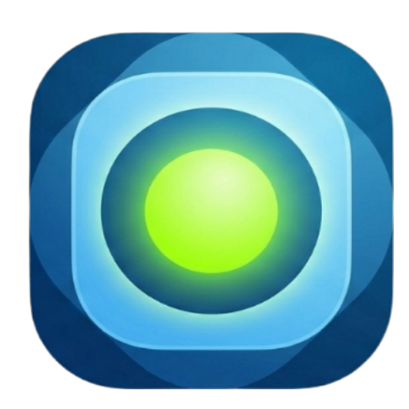

# ◈ Priority Engine — SmartFocus Dashboard

> A browser-based productivity dashboard that calculates a **Focus Score** for every task so you always know exactly what to work on next.



**Live Demo → [feyisara-o.github.io/Priority-Engine](https://feyisara-o.github.io/Priority-Engine/)**

---

## Overview

Most to-do apps just list tasks. Priority Engine *ranks* them.

Every task is scored using a weighted algorithm based on **Impact** and **Urgency**. The result is a Focus Score from 20–100 that tells you — at a glance — where your attention should go. Pair that with a built-in focus timer, real-time time analytics, and an AI insight panel, and you have a complete personal productivity engine running entirely in the browser.

No frameworks. No database. No account required.

---

## Features

### 🧮 Focus Score Algorithm
Each task receives a score calculated as:
```
FocusScore = (Impact × 0.6 + Urgency × 0.4) × 20
```
Impact is weighted higher than urgency because high-impact work drives real results — urgency is often manufactured noise. Tasks are automatically sorted highest to lowest score on every update.

### ⏱ Focus Timer
- Start, pause, resume, and stop per task
- Counts up in `HH:MM:SS` format
- Time logs directly to the selected task as a badge in real time
- Persists logged time to localStorage on stop

### 🧠 AI Insight Panel
A dynamic insight card monitors your timer activity and:
- **Warns** you (amber) when you're timing a low-priority task while a critical one is waiting
- **Commends** you (teal) when you're working on your highest-priority task
- Updates in real time as the timer runs

### ◑ Time Analytics (SVG Pie Chart)
- Real-time pie chart showing time distribution across timed tasks
- Built entirely with raw SVG — no chart library
- Task name labels on each slice, color-coded legend with time and percentage

### 🔔 Completion Sound
- Soft sine-wave pop plays when a task is marked complete
- Generated via the Web Audio API — no audio files needed
- Toggle on/off from the header

### 💾 localStorage Persistence
All tasks, logged time, and state survive page refreshes and browser restarts automatically.

### 📱 PWA — Installable & Offline
- Fully installable on Android and iOS home screens
- Works completely offline via a Service Worker and Cache API
- Launches in standalone mode with no browser UI

### 🎨 Glassmorphism UI
Dark glassmorphism aesthetic with animated ambient orbs, frosted glass panels, and a fully responsive mobile-first layout.

---

## Tech Stack

| Layer | Technology |
|---|---|
| Structure | Semantic HTML5 |
| Styling | CSS3 — Custom Properties, Grid, Flexbox |
| Logic | Vanilla ES6+ JavaScript |
| Charts | Raw SVG (hand-built, no library) |
| Sound | Web Audio API |
| Persistence | localStorage API |
| Offline | Service Worker + Cache API |
| Install | Web App Manifest (PWA) |

**Zero frameworks. Zero external libraries. Zero dependencies.**

---

## Under the Hood

### Weighted Scoring Model
The Focus Score formula mirrors real product prioritization frameworks like RICE and ICE scoring used at companies like Linear and Intercom. Impact carries 60% weight because urgency — notifications, deadlines, requests — is often artificial pressure. The algorithm surfaces work that genuinely moves the needle.

### State → Render Loop
The app follows a unidirectional data flow pattern — the same mental model used by React and Vue, implemented manually:
```
User Action → Mutate State → saveTasks() → render()
```
The entire UI is rebuilt from state on every update. This makes the app predictable and debuggable — the UI is always an exact reflection of the data.

### Event Delegation
Rather than attaching click listeners to every task item (which are dynamically injected), a single listener sits on the parent `<ul>`. Clicks bubble up and are identified via `data-action` and `data-id` attributes. This works regardless of when items are added or removed.

### SVG Pie Chart
The chart is drawn from scratch using SVG `<path>` elements. Each slice is calculated with trigonometry — `Math.cos()` and `Math.sin()` convert angles to x/y coordinates on a circle of radius 80. No D3, no Chart.js.

### Service Worker Strategy
Uses a **Cache First** strategy — every request checks the local cache before hitting the network. Assets are pre-cached on install. Bumping `CACHE_NAME` triggers the activate event to wipe old caches on the next visit.

---

## Setup

```bash
# Clone the repo
git clone https://github.com/feyisara-o/Priority-Engine.git

# Serve locally (required for Service Worker)
npx serve .

# Open in browser
http://localhost:3000
```

> Opening `index.html` directly via the file system will work for the app itself, but the Service Worker requires a local server or HTTPS to register.

---

## Project Structure

```
Priority-Engine/
├── index.html          — Semantic HTML structure & ARIA
├── manifest.json       — PWA install configuration
├── sw.js               — Service Worker (offline + caching)
├── css/
│   └── style.css       — Design system, layout, components
├── js/
│   └── script.js       — All app logic, algorithm, state
└── icons/
    ├── icon-192.png    — PWA home screen icon (Android)
    └── icon-512.png    — PWA splash screen icon
```

---

## Author

**Feyisara** — [@feyisara-O](https://github.com/feyisara-O)

---

*Built with Vanilla JS, HTML5, and CSS3 — no frameworks were harmed in the making of this project.*
